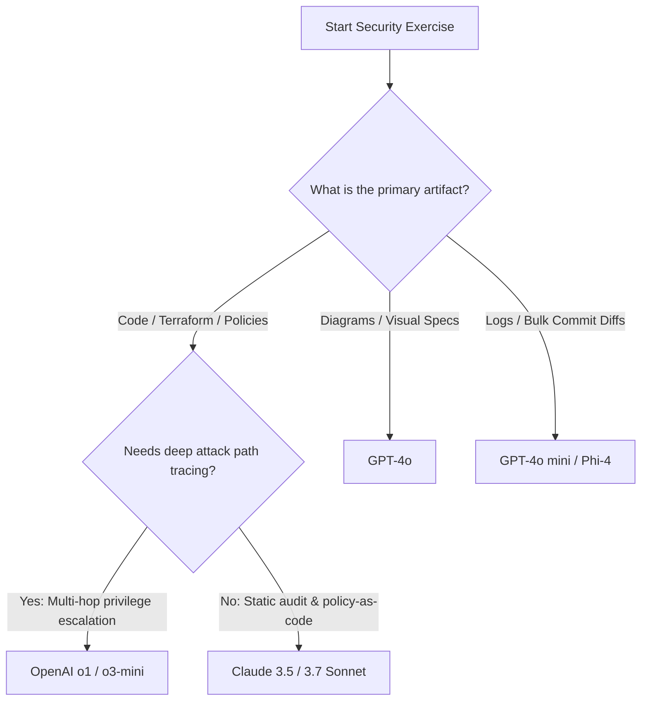

# Model Comparison & Review: GitHub Ecosystem for Security & Engineering Workflows

This document reviews the primary language models available through the GitHub ecosystem (GitHub Copilot and GitHub Models marketplace), evaluating their performance, trade-offs, and suitability across security audits, threat modeling, marketing, and general engineering tasks.

---

## 1. Executive Summary & Quick Recommendations

| Use Case / Domain | Recommended Model | Secondary Alternative | Key Reason |
|---|---|---|---|
| **IaC & Policy Auditing** (Terraform, Vault, OPA/Rego) | **Claude 3.5 / 3.7 Sonnet** | OpenAI o3-mini | Highest precision in code syntax, lowest false-positive hallucination rate. |
| **Threat Modeling & Attack Paths** | **OpenAI o1 / o3-mini** | Claude 3.7 Sonnet (Thinking) | Step-by-step reasoning explores edge cases, privilege escalations, and delegation chains. |
| **Multimodal Review** (Arch Diagrams, Topology) | **GPT-4o** | Claude 3.5 Sonnet | Native image/vision capabilities with strong structured schema generation. |
| **High-Throughput / Triage** (Log scanning, Pre-commit) | **GPT-4o mini** | Phi-4 | Extremely fast, low cost per token, ideal for initial filtering. |
| **Marketing & Copywriting** | **Claude 3.5 Sonnet** | GPT-4o | Natural tone, consistent voice adherence, and compelling narrative flow. |
| **Large-Scale Corpus Synthesis** (1M+ tokens) | **Gemini 1.5 Pro** | Claude 3.5 Sonnet | Massive 1M–2M context window for digesting full repos and compliance standards. |

---

## 2. Comprehensive Model Matrix

| Model | Provider | Key Strengths | Limitations / Trade-offs | Ideal Workloads |
|---|---|---|---|---|
| **Claude 3.5 / 3.7 Sonnet** | Anthropic | Industry-leading code generation, nuanced reasoning, exceptional understanding of security baselines and policy syntax. | Higher latency than mini models; strict safety refusals on raw exploit payloads. | Static analysis, code reviews, Terraform validation, API security, and brand copywriting. |
| **OpenAI o1** | OpenAI | Deep chain-of-thought reflection, multi-step problem solving, formal logic verification. | Higher latency; hidden reasoning tokens add to overall cost; non-multimodal for o3-mini. | Non-human identity delegation chains, complex RBAC verification, cryptographic audits. |
| **OpenAI o3-mini** | OpenAI | Fast reasoning capabilities, adjustable reasoning effort, highly cost-effective for analytical tasks. | No vision input support; can over-analyze simple tasks. | CI/CD pipeline policy checks, algorithmic security analysis, automated test generation. |
| **GPT-4o** | OpenAI | Versatile multimodal comprehension, high generation speed, reliable JSON schema compliance. | Slightly higher rate of subtle logic oversights compared to dedicated reasoning or Sonnet models. | Architecture diagram analysis, incident response runbook generation, full-funnel ideation. |
| **GPT-4o mini** | OpenAI | Low latency, highly cost-efficient, handles basic instructions reliably. | Struggles with multi-file contextual dependencies and subtle security vulnerabilities. | Commit hook secret scanning, log triage, simple PR summarization. |
| **Phi-4** | Microsoft | Compact footprint, strong reasoning for its size, optimized for specialized enterprise benchmarks. | Reduced knowledge breadth compared to frontier models; smaller context window. | Edge deployment, lightweight rule validation, local/embedded triage. |
| **Llama 3.3 70B** | Meta | Open-weights foundation, strong community fine-tunes, balanced general capability. | Less fine-tuned on proprietary cloud IAM schemas (e.g., Azure Entra ID, HashiCorp Vault RBAC). | On-prem/private sandbox evaluations, general automation scripts. |
| **DeepSeek-R1** | DeepSeek | Open-weight reasoning model with chain-of-thought output visibility. | Variable performance across strict enterprise compliance formats and schema constraints. | Experimental vulnerability discovery, open audit workflows. |

---

## 3. Deep Dive: Security Exercise Suitability

### A. Infrastructure as Code (IaC) & Secret Hygiene
* **Top Pick:** `Claude 3.5 / 3.7 Sonnet`
* **Why:** Auditing HashiCorp Vault policies, Kubernetes Helm charts, and Azure/AWS Terraform definitions requires strict adherence to declarative syntax. Claude Sonnet consistently identifies missing least-privilege configurations, exposed public endpoints, and unapproved secret references without generating hallucinated resource arguments.

### B. Identity, Delegation Chains & Attack Surface Analysis
* **Top Pick:** `OpenAI o1 / o3-mini`
* **Why:** Non-Human Identity (NHI) governance, OAuth on-behalf-of (OBO) flows, and cross-account trust boundaries require exploring combinatorial state paths. Reasoning models systematically test every permutation of role assumptions and token exchanges to locate potential privilege escalation vectors.

### C. Architecture Diagrams & Visual Threat Modeling
* **Top Pick:** `GPT-4o`
* **Why:** Exercises that involve reviewing network diagrams, ingress/egress topologies, or cloud dashboard exports benefit from GPT-4o's native vision processing, translating visual boundaries into actionable threat matrices (STRIDE/PASTA).

---

## 4. Selection Flowchart

